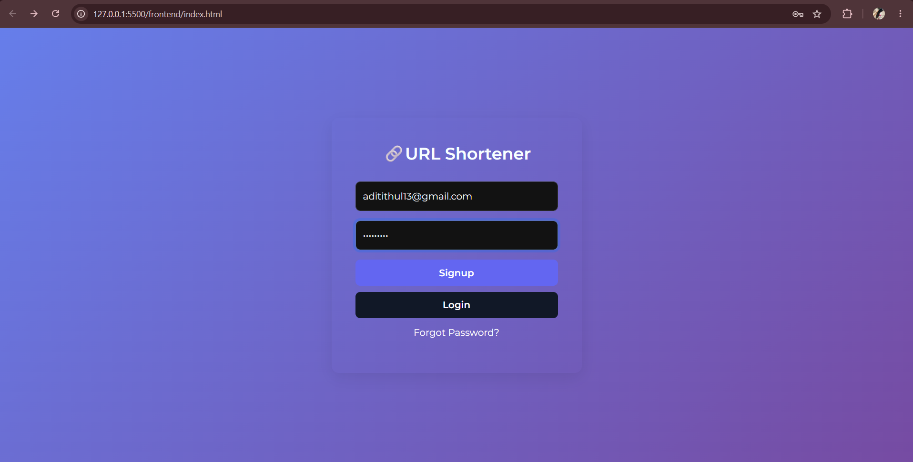
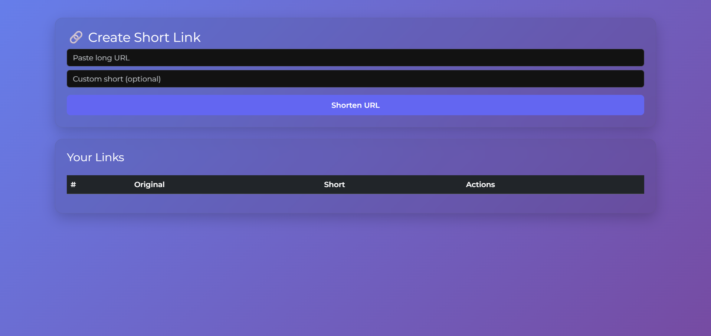
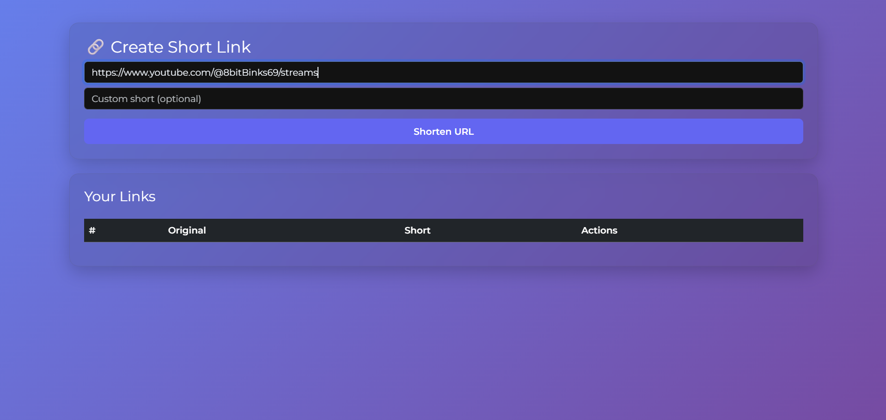
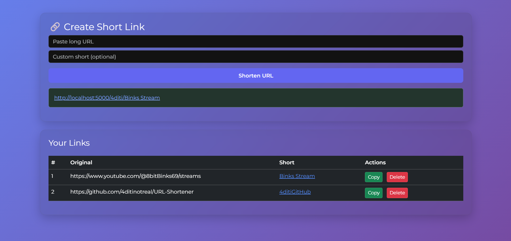

# 🔗 URL Shortener

A full-stack URL Shortener web application that allows users to create shortened URLs, manage their accounts, and securely access their personalized dashboard. The project is built using **Node.js, Express.js, MongoDB, AngularJS, HTML, CSS, and Bootstrap**.

---

## 🚀 Features

- 👤 User Registration (Signup)
- 🔐 User Login Authentication
- 🔑 Forgot Password & Password Reset
- ✂️ Shorten Long URLs
- 🔗 Redirect Short URLs to Original URLs
- 📊 User Dashboard
- 💾 MongoDB Database Integration
- 🎨 Responsive & Modern UI

---

## 🛠️ Tech Stack

### Frontend
- HTML5
- CSS3
- Bootstrap 5
- AngularJS

### Backend
- Node.js
- Express.js

### Database
- MongoDB
- Mongoose

---

## 📂 Project Structure

```text
url_shortener/
│
├── backend/
│   ├── controllers/
│   ├── models/
│   ├── routes/
│   ├── services/
│   └── server.js
│
├── frontend/
│   ├── controllers/
│   ├── services/
│   ├── views/
│   ├── app.js
│   └── index.html
│
├── package.json
├── package-lock.json
└── README.md
```

---

## ⚙️ Installation

### Clone the repository

```bash
git clone https://github.com/4ditinotreal/URL-Shortener.git
```

### Navigate to the project

```bash
cd URL-Shortener
```

### Install dependencies

```bash
npm install
```

### Start MongoDB

Make sure your local MongoDB server is running.

### Start the backend

```bash
node backend/server.js
```

The backend will run at:

```
http://localhost:5000
```

### Run the frontend

Open `frontend/index.html` using **Live Server** in VS Code.

---

## 📸 Screenshots

### Login Page


### Dashboard


### URL Shortening


### Home Page


## 🔮 Future Enhancements

- 💳 Payment Gateway Integration
- 📈 URL Analytics
- 📊 Click Tracking
- 📱 QR Code Generation
- 📅 Link Expiration
- ⭐ Premium Plans
- 📋 Copy-to-Clipboard Button
- 🌙 Dark Mode

---

## 🤝 Contributing

Contributions, suggestions, and improvements are welcome. Feel free to fork the repository and submit a pull request.

---

## 📄 License

This project is created for learning and educational purposes.

---

## 👩‍💻 Author

**Aditi Thul**

GitHub: https://github.com/4ditinotreal